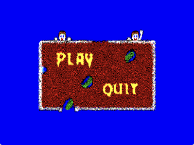
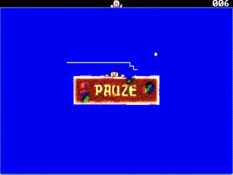

# GSNAKE for the Sanyo MBC-555

<p>
  
  
</p>

A new 8088 port of **GSNAKE**, the Snake game originally written for DOS in
1996. The source version ran on a 386 in VGA mode 13h; this project builds a
bootable floppy image for the native video hardware of the Sanyo MBC-555.

## Purpose and starting point

The original DOS/TASM package is preserved as
`gsnake-1996-TASM.zip`. It contains the original `GSNAKE.ASM`, `MENU.DB`,
the 1996 executable, and its TASM/TLINK build files.

The Sanyo version is independent from the DOS output. It is written for the
real constraints of the MBC-555 and does not use BIOS or DOS video services.

| Component | Original GSNAKE | Sanyo port |
| --- | --- | --- |
| CPU | 80386 instructions possible | 8088 / `cpu 8086` |
| Video | VGA mode 13h, 320×200 | Native Sanyo RGB, 640×200 |
| Colour | 256-colour palette | Three bitplanes: red, green, blue (8 colours) |
| Program | DOS `.COM` | Bootable 180 KiB floppy image |
| Video memory | Linear VGA buffer at A000h | Three separately organised, non-linear planes |

Conversion from 256 to 8 colours is intentionally not automated. PNGs in
`assets/original-vga/` are exported from the old game. Dithering and colour
reduction for the Sanyo are performed manually; the results live in
`assets/sanyo/`.

## Current status

`app.asm` currently:

1. starts 640×200 mode;
2. displays the 400×116 Sanyo menu at startup;
3. starts a game with `P` or Space, pauses and resumes with `P`, and returns
   to the menu after a collision;
4. supports WASD, the numeric keypad (`8`, `4`, `5`, `6`), and the four
   physical Sanyo cursor keys; repeating the current direction gives a boost;
5. draws a moving, growing white snake, a blue/cyan patterned border, a
   transparent yellow food ball, and status sprites;
6. shows a double-width ROM-font score, plays food and game-over sounds, and
   displays the 240×48 pause overlay;
7. shows credits with `Q` or `Esc`, from either the menu or the game.

The menu image has no header and consists of three linear planes in blue,
green, red order. Each plane is stored as conventional scanlines and converted
to the Sanyo layout when drawn.

## Sanyo video and image import

The MBC-555 uses these RGB planes on real hardware:

```asm
RED   equ 0f000h
GREEN equ 01c00h
BLUE  equ 0f400h
```

In 640×200, one plane consists of 50 blocks of four scanlines. Each block is
320 bytes. The four bytes of one horizontal byte column belong to the four
scanlines of that block:

```text
byte 0, 1, 2, 3   = same x position at y, y+1, y+2, y+3
byte 4, 5, 6, 7   = next byte column on those four scanlines
```

A partial image therefore cannot be copied with one `rep movsw`. The image
copy routines in `app.asm` convert four consecutive source lines to this layout
and advance to the next 320-byte Sanyo video row after each image row.

An image whose height or starting y coordinate is not a multiple of four needs
extra handling at a block boundary. The current menu, top sprites, and pause
overlay are all aligned to a four-scanline boundary.

## Build and run

Requirements:

- NASM
- MAME with the `mbc55x` machine

Start the game interactively from this directory:

```sh
sh build.sh
```

This builds `app.img` and opens it in a MAME window. `build.sh` first closes
any already-running MAME processes.

## Visual regression checks

Use this after each change to graphics or video memory:

```sh
./capture.sh
```

It builds the image, launches MAME visibly for three seconds, and saves MAME's
final frame through its built-in snapshot feature as:

```text
captures/gsnake.png
```

The screenshot uses MAME's native 640×200 view with bilinear filtering
disabled. Pass a different visible duration if needed:

```sh
./capture.sh 5
```

This capture workflow is the preferred way to check image conversion; merely
assembling is insufficient for graphical changes.

## Working conventions

- Make a small Git commit with a descriptive message after each completed,
  working step. Do not mix unrelated changes into it.
- Always build graphics, bitplane, or video-RAM changes with `./capture.sh` and
  inspect `captures/gsnake.png` before committing.
- When porting game behaviour, consult the original source in
  `gsnake-1996-TASM.zip`. Reuse its logic, but rewrite VGA- and 386-specific
  code for the 8088 and Sanyo VRAM layout.

## Files

| Path | Purpose |
| --- | --- |
| `app.asm` | Current GSNAKE port and video-import code |
| `header.asm` | Boot sector, floppy loader, Sanyo constants, and CRTC setup |
| `footer.asm` | Sector and floppy padding |
| `build.sh` | Builds and starts MAME interactively |
| `capture.sh` | Builds, runs MAME briefly, and writes a screenshot |
| `doc/` | README screenshots |
| `gsnake-1996-TASM.zip` | Preserved original DOS/TASM package |
| `assets/original-vga/` | Unmodified PNG exports of the original VGA assets |
| `assets/sanyo/` | Manually reduced/dithered Sanyo assets and `.pic` data |

## Constraints

The port must not fall back on 386 instructions, VGA registers, or a
256-colour palette. Keep new code compact: the 8088 is slower and the boot
image must fit on a single-sided 180 KiB floppy.

Generated `*.img`, `*.lst`, and `captures/` files should normally not be
committed.
